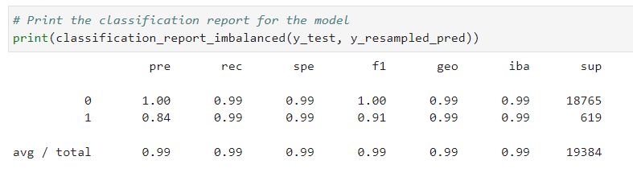

# Challenge 12 Credit Risk Resampling

## Introduction
This project explores machine learning using Jupyter Labs, SK Learn, and Imb Learn.

## Data
We use loan data to predict health and high-risk loans.

First we create a logisitc regression model with the original data. Here is the confusion matrix:

Then we use the Random Over Sampler and retrain the data.  Here is the confusion matrix:

## Conclusion
Open report.md for a complete conclusion.