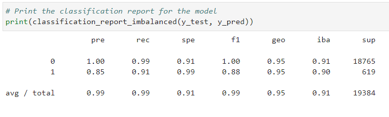
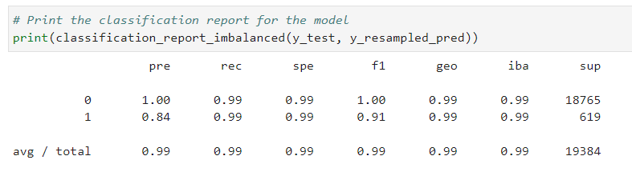

# Module 12 Report

## Overview of the Analysis

The purpose of this analysis was to build a model that can predict which loans will be healthy and which will be high-risk. The data we are buliding this model on contained almost 80k loans, of which, 2500 of them were marked as high-risk. The data contained additional infomraitn such as: loan size, interest rate, borrower income, debt to income, number of accounts, derogatory marks and total debt.

Our model sperates the data in to two categories. The y variable noting high-risk or healthy. The X variable having the rest of the loan data. Using LogisticRegression the model attempts to predict from X if the loan will be healthy or high-risk and then checks the accuracy with y.

## Results

Machine Learning Model 1

Machine Learning Model 2

## Summary
Both models did a pretty good job and they weren't wildly different.  Becuase we are looking for high-risk loans we do care more about "1" than we do "0".  Additionally, recall should be a better indicator of actually high-risk loans that were correctly predicted.

With this in mind I would recommend using the oversampled Model 2 as it has a much higher recall score of 99% compared to 91%.
